# Building your own website with Node-Red

We have created a website which you can use to create a simple website for your own company. In this exercise,
you will learn how it is built and how you can change the layout. 

The sample you will start off with was made for our company idea, ReutiliZe. The website looks like this. 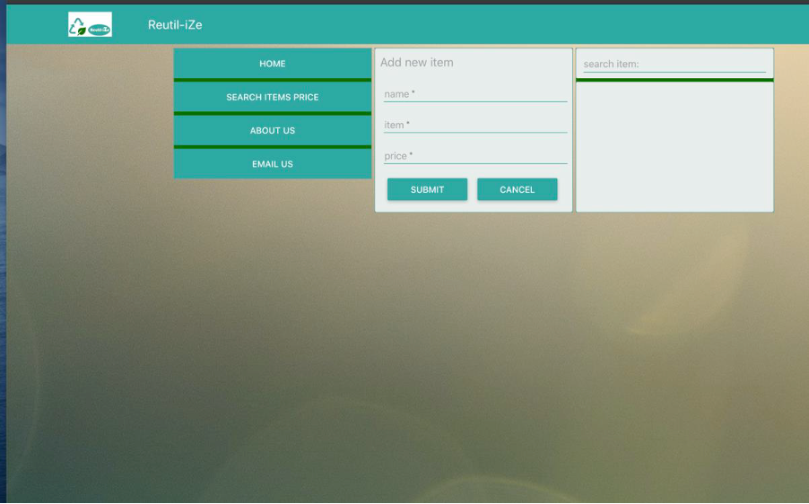

In the image above, make note of the following:

* On the top horizontal bar, you will find the name and logo of our company.
* Below on the main site there are 3 sections.
  * Column 1: vertical menu buttons
  * Column 2: input form
  * Column 3: A search form with the output screen.

We are providing you with step-by-step directions to create this website for your. Just follow the actions
below.

# **1 - Create a Node-Red service on IBM Cloud**

1.1 Go to the IBM website http://cloud.ibm.com

1.2 Create an account by selecting **"create an account"** and follow the steps.

1.3 Once you have created the coount you can login to the IBM Cloud website.

1.4 Select in the upper menu options **"catalog"**

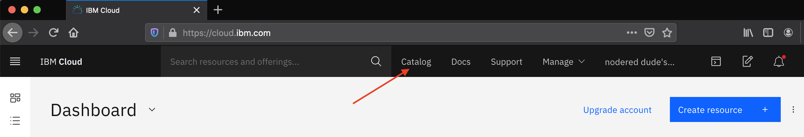

1.5 In the search field type in **"Node Red"** and hit the **"Node Red app"**

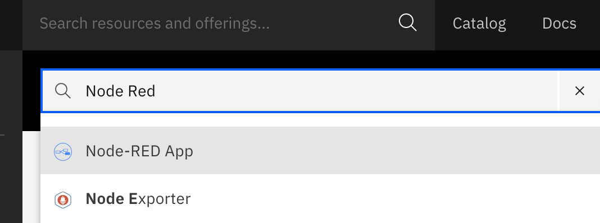

1.6 In the next flied press **"get started"**

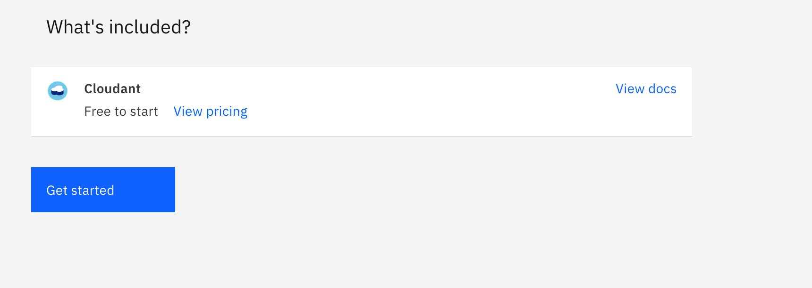

1.7 In the next field please make sure you select the **"lite"** pricing plan. This is the free version.

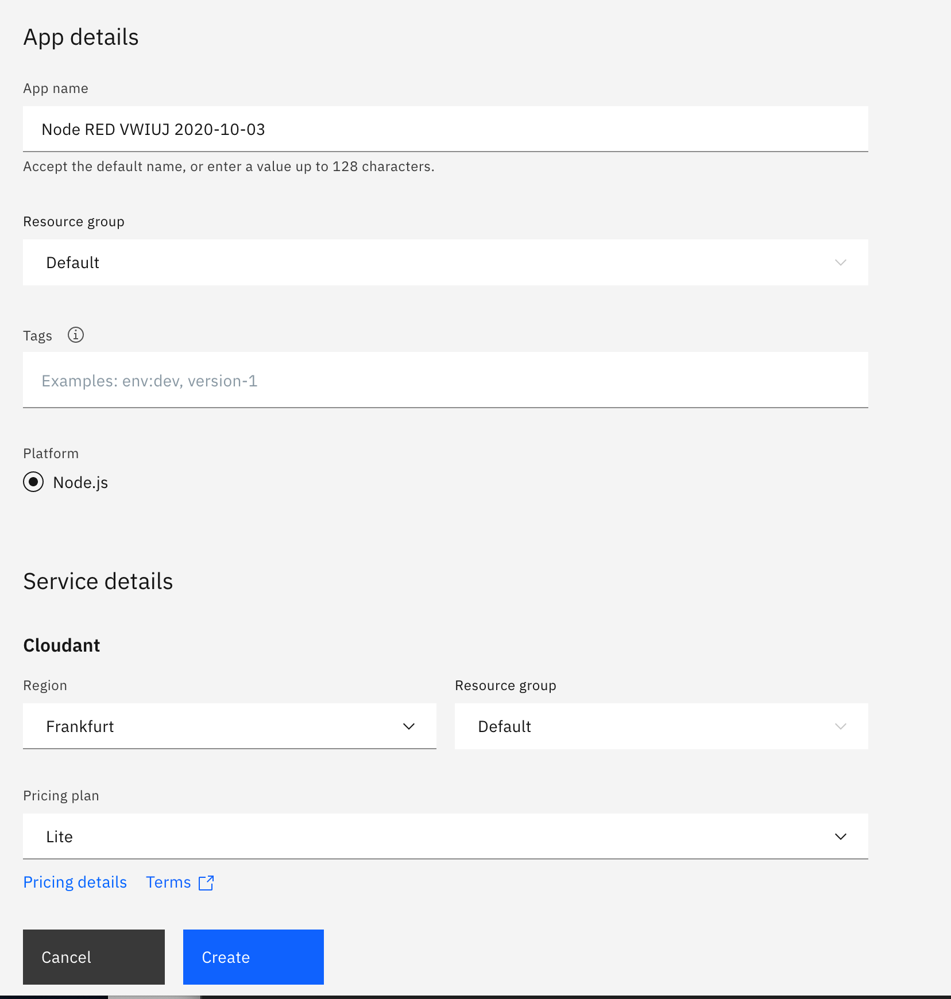

1.8 Hit the **"create"** button. The app will be created. This may take up to 30 seconds.

1.9 In the text field select the blue button **"deploy your app"**

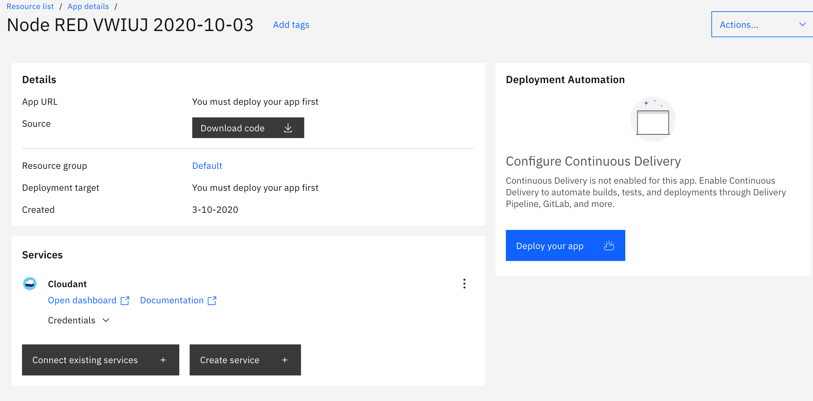

1.10 In the next fiels you see a red square where an **"API key"** is needed. select the button **"new"** and a popup will appear. 

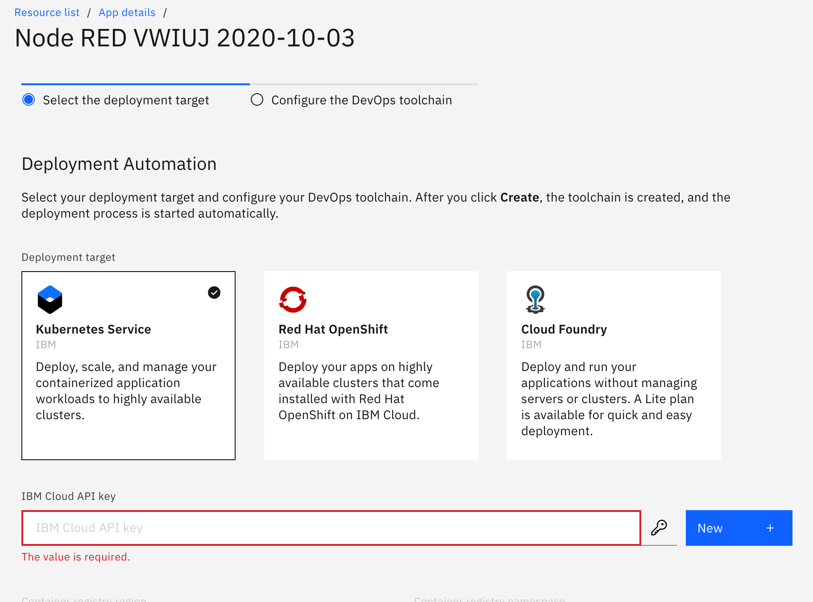

1.11 select **"create"**

1.12 Important! In the upper field select the tile stating **"cloud foundry"**

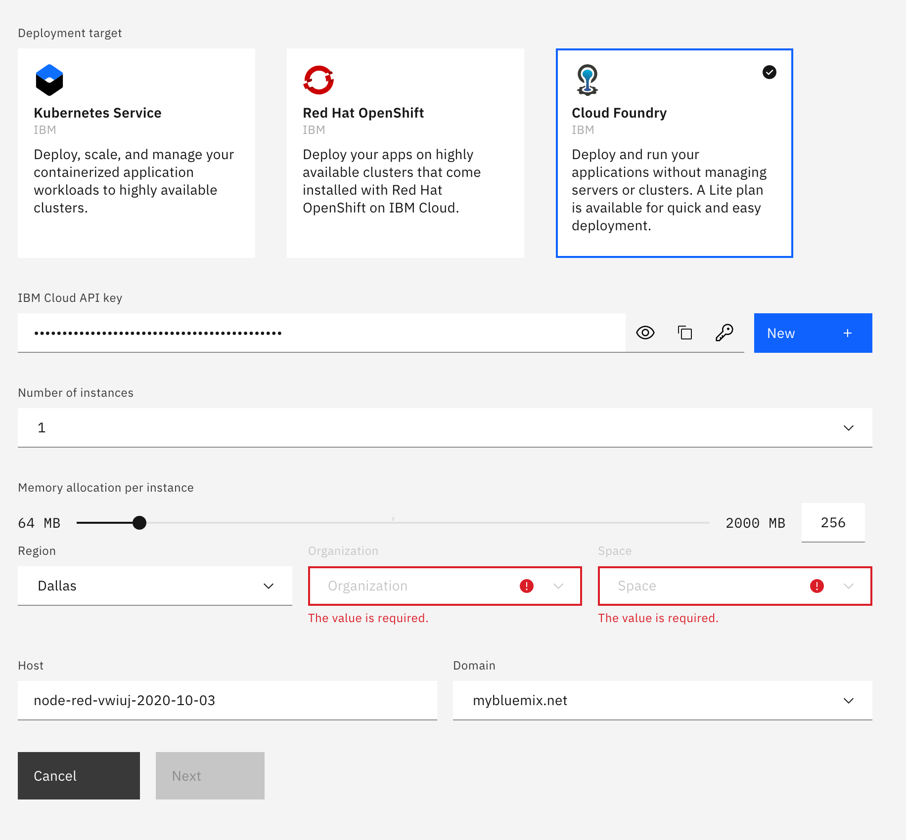

1.13 Now there will be most probably be an error in the fields below. This is because you need to select your **"region""** attached to your account. Use the pull down menu to select the proper region. If you don't know which one to use, select them until the red errors dissapear. A host name will be generated.

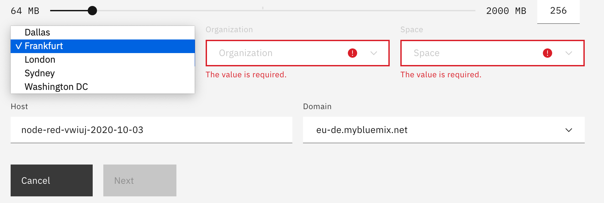

1.14 Press **"next"** and **"create"** 

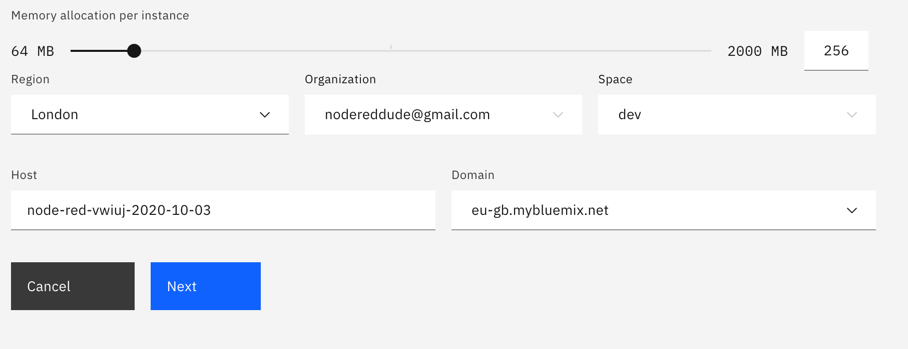

Now we have created an Node Red app as well as a place in the Cloud where we can run the app on. Now the app will be deployed automatically. This can take up to 5 minutes. You can monitor the progess in the status field. Wait until the status changes from **"in progress"** to **"success"**

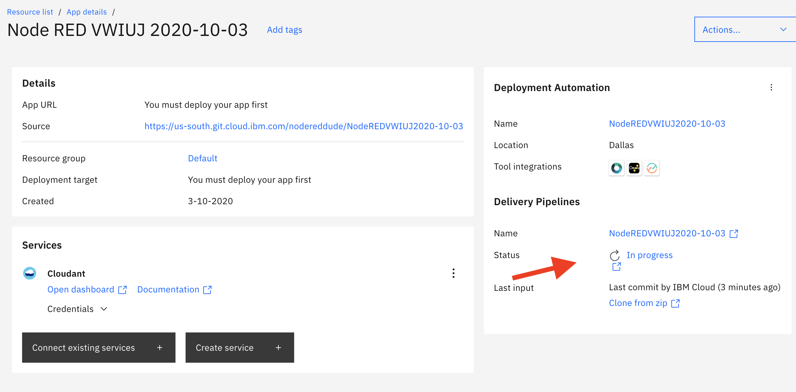

1.15 Click on the name of your app under **"delivery pipelines"**

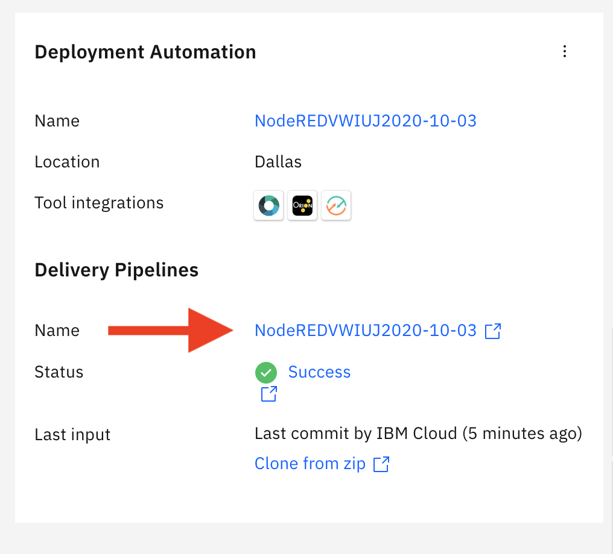

1.16 You see the steps you have done. You have created the Node-Red app and you have deployed it in the IBM Cloud. Now, to go to your app select **"view console"**

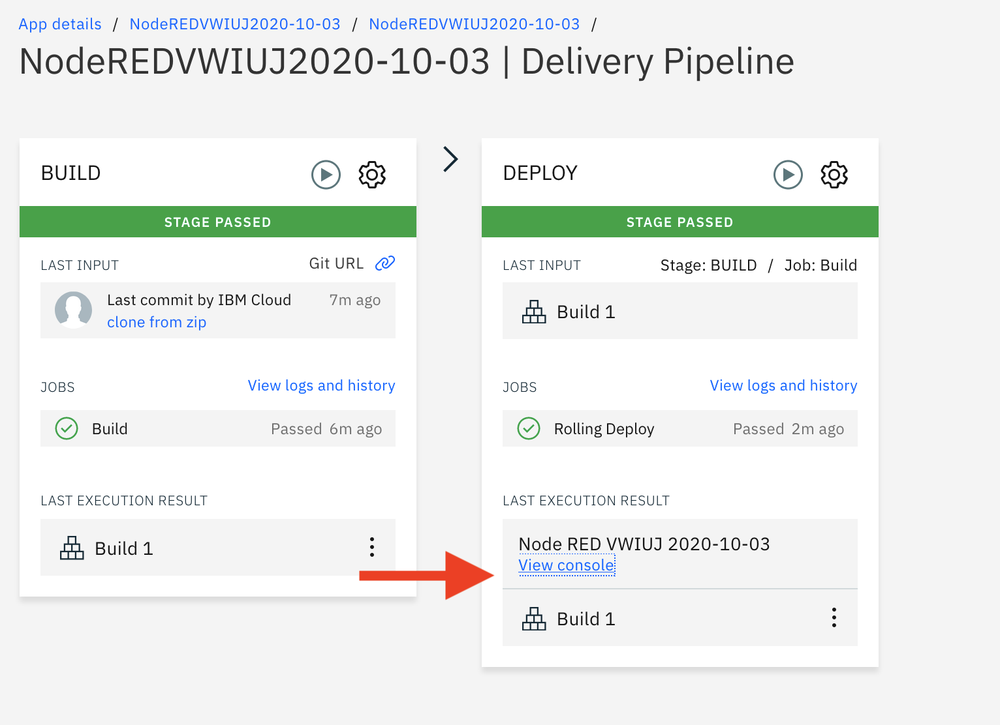

1.16 Now you see the dashboard of your Node-Red app. You can see the amount of data which is being used, and if you would use a Payed account (which we not do) the amount of charging". Now select **"Visit app URL"**

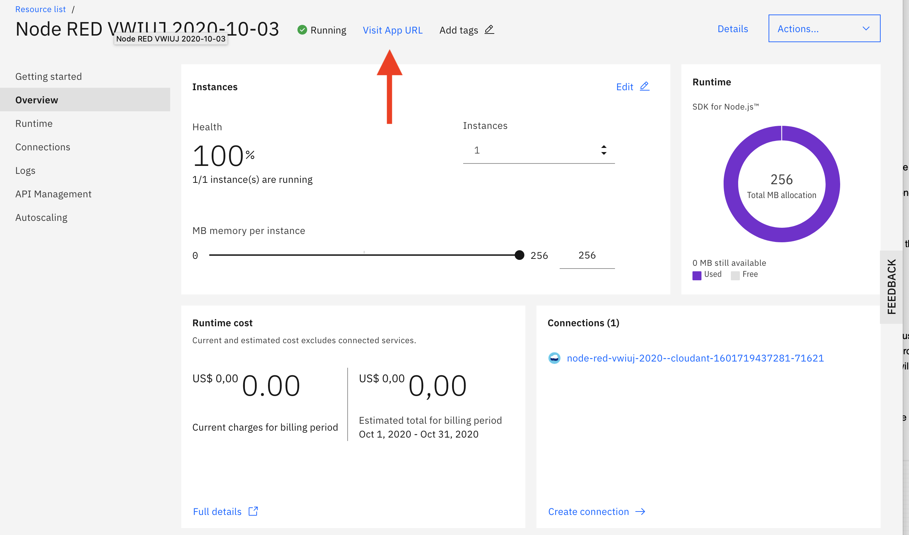

1.17 Now you are in your Node-Red app. When opening this the first time you will get some options to set an User ID and Password. Follow the steps until you get the Node-Red landing page with the button **"go to your node-red editor""**.

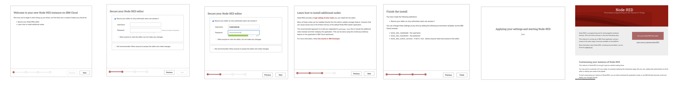

1.18 Congratulations! You can now log in to your Node-Red editor with the User ID and Password you have created in step 1.17.

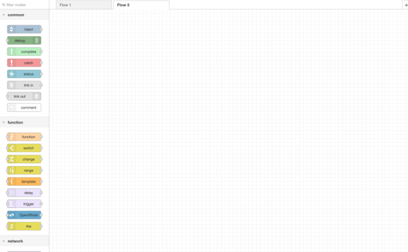
You will end with a Node-Red instance which looks like this. If you look at the screen you will see the building blocks, called “nodes” on the left side. In the  middle you have the area where you can drag and drop your building blocks to and connect them together. Feel free to play around a bit. You can delete a Node by hitting the “delete” button after selecting it.

# **2 - Install additional Nodes**

2.1 Open the hamburger menu on the upper right corner(1). This opens a menu like this. Choose the option “manage palette” (2).

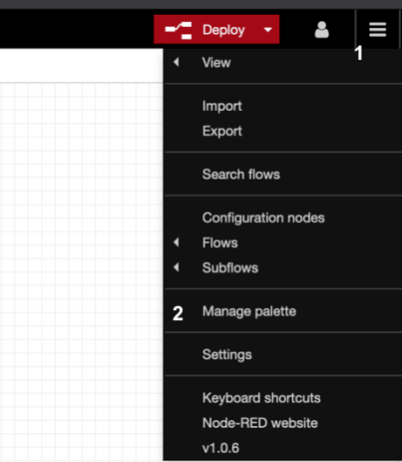

2.2The “Manage Palette” opens a screen where you can find all the Nodes which are installed, and an option to search and install additional Nodes.

2.3 Select the “install” tab and in the search field type the word “dashboard”. This gives you all the nodes and node collections for the Dashboard usage. Select the one called “ **Node-Red-Dashboard”** and hit install.

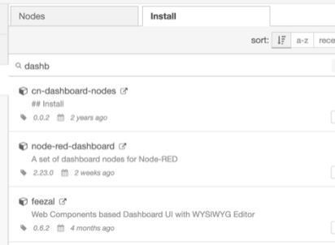

Now some additional Nodes are being installed. This may take up to one minute.
Please note that in some occasions a red error will occur saying that the installation has failed. You need to try again until you get a large green message that the installation was successful. This is a bug which can happen sometimes depending on your location.

2.4 Close the field and return to the main screen. Inspect the left side
of the screen and look for the nodes installed under “ **dashboard** ”.

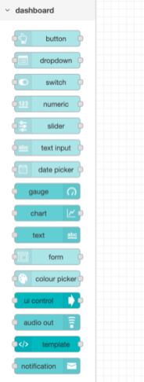

The Dashboard Nodes are being used to build a graphical screen which you can use to interact. This will be our website. I have created the example website for you which uses these Nodes.

# **3 - Import an existing code**

The next step is to import the example website so you do not have to build it
yourself from scratch... lets go.

3.1 Open the file [website.txt](website.txt). The file is provided in the Github repository
You can open it with any text editor installed on your computer. When opening it, it will look most probably weird and not understandable. don’t worry. This is why we use Node-Red, so we don’t need to understand the coding language.

3.2 Please open the file an select all the text(pressing ctrl +a) and then copy (ctrl + c).

3.3 Go back to your Node-Red environment and select the hamburger menu on the upper right corner. This opens the menu we already used.
Select “ **Import** ”.
This opens a screen where you can “paste” the code from the website.txt. 
Paste the code with ctrl + v. Now you will see the code appearing in the pink colored middle section.

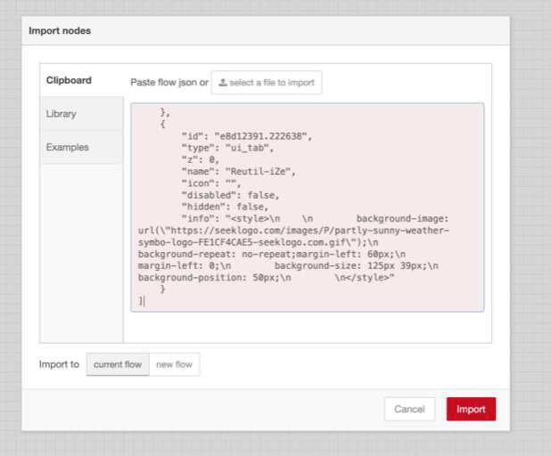

3.4 Press “ **Import** ”.

3.5 Press the **“deploy”** button to save and activate the flow.

The Nodes are used to build the website which I have showed at the beginning. The
white blocks are text fields to explain what the nodes below do. Take a moment to
see how it is related to the website.

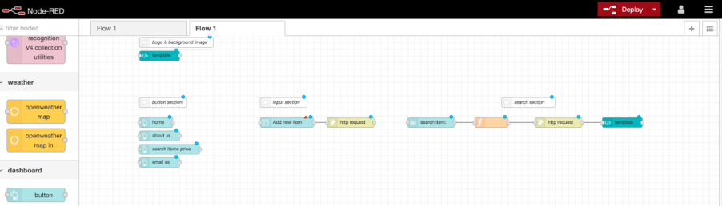

Tip: In order to see the webpage you need the same internet address as used for
your Node-Red environment **BUT** instead of having the **"/ red"** at the end use **"/ui"**. UI means User Interface. The URL should look something like this:

Node-Red environment-   **http://node-red-xxxxxxxx.mybluemix.net/red/**

Node-Red website-       **http://node-red-xxxxxxxxx.mybluemix.net/ui/**

# **4 Changing the website**

It is now easy to change the website look and name by double clinking on the nodes and change the codes.

4.1 Click on the right side on the small thick line which you can drag to the left and open an option menu(1). the third button with the little bar Graph you will see the options for the website(2). 

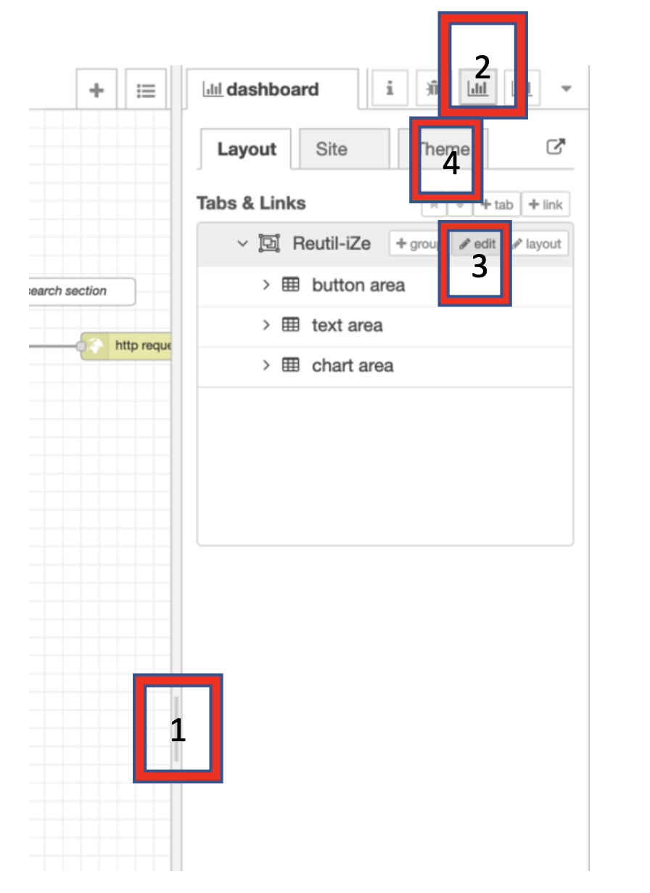

4.2 Select the “edit” button (3) and change the name to your company

4.3 Look at the tab called “ **Theme** ” (4) and change the colors of the website.

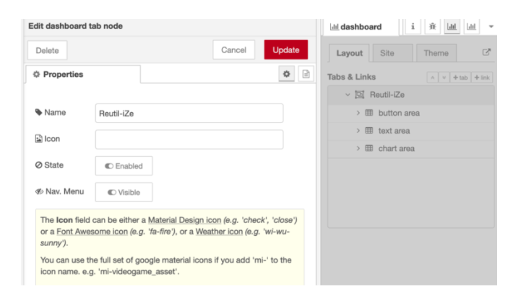

# **Bonus**
If you look at the Nodes there is a Node called ”template”. If you click on the node you will see coding which controls the little logo of the website and the background picture. You can change the website URL to anything else as long as it is pointing to a picture on the internet.

In my case the links will direct to the logo image and background image. Try to click
on the link and you will see:

**"https://github.com/jorismertens/Node-Red_API_Dashboard/blob/master/images/Reutilize_logo.png?raw=true"**

Now try to change URL address to a different picture. For example another
background image.

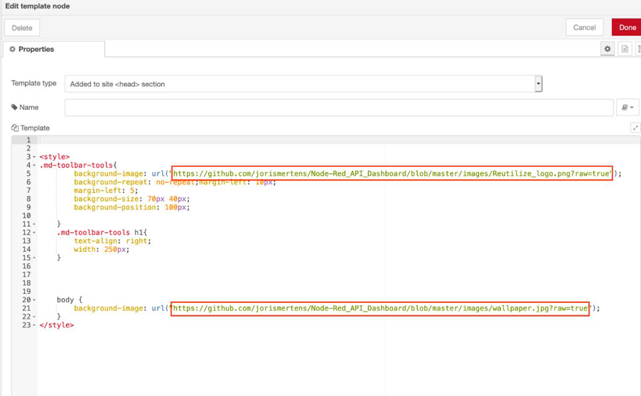

**Tip: Do not forget to close and deploy the Node-Red flow after every change!**

